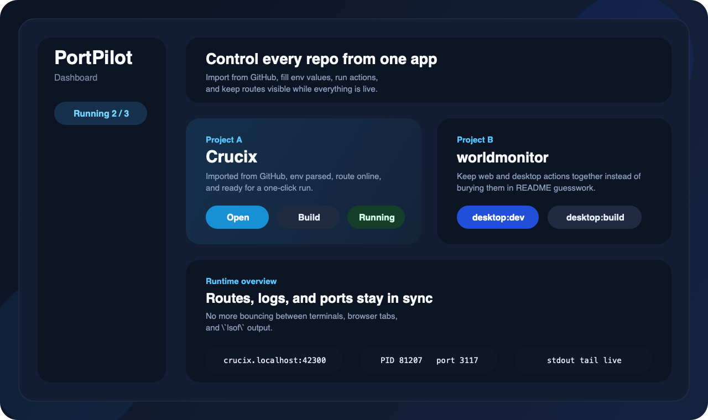
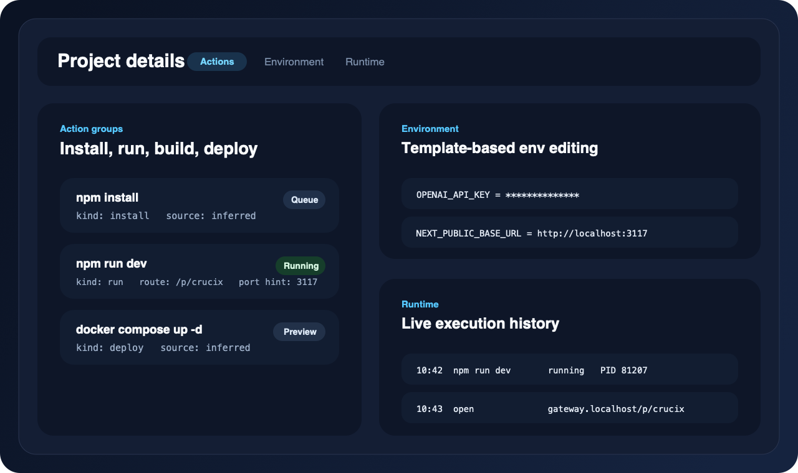
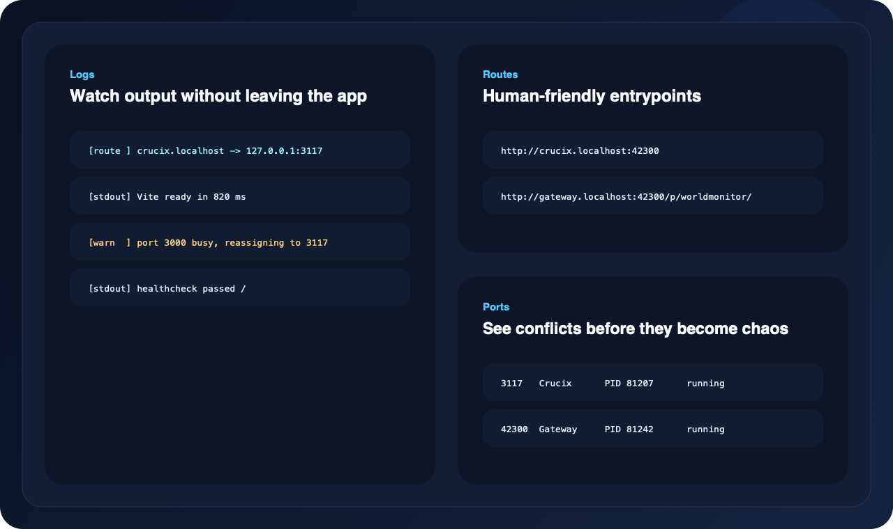

[简体中文](./README.zh-CN.md) | **English**

<div align="center">
  <h1>PortPilot</h1>
  <p><strong>The desktop workspace for localhost app stacks.</strong></p>
  <p>Import a GitHub repo, apply safe local defaults, launch the right stack, and keep routes, logs, ports, health, and shared services in one place.</p>

  <p>
    <a href="https://github.com/Horace-Maxwell/portpilot/releases/tag/v0.1.2">
      
    </a>
    <a href="https://github.com/Horace-Maxwell/portpilot/releases">
      
    </a>
    <a href="./README.zh-CN.md">
      
    </a>
  </p>

  <p>
    
    
    
    
    
  </p>
</div>


## What PortPilot Is

PortPilot turns messy localhost repos into a usable desktop workflow:

- Import a repo or register an existing root
- Infer the right entrypoint for Node, Python, Rust, Go, and Compose-heavy projects
- Fill in safe local env defaults before you hit a wall
- Launch the full stack, not just one command
- Route apps to clean `.localhost` URLs with local HTTPS
- Keep logs, ports, health, services, and Doctor guidance in one workspace

If your current setup is "five terminals, one README, two `.env` files, a Docker service, and a port conflict," PortPilot is the product for that moment.

## Who It's For

- Indie developers juggling multiple localhost repos
- AI app builders working with Open WebUI, Flowise, LibreChat, OpenClaw, ComfyUI, LocalAI, and similar stacks
- Full-stack teams onboarding mixed Node + Python + Compose repositories
- People who want a cleaner local workflow than raw terminal tabs, but do not want cloud devboxes for everything

## Why It Wins

| Import once | Launch the stack | See what is broken |
| --- | --- | --- |
| Turn GitHub URLs and local folders into managed project profiles. | Start the recommended entrypoint plus managed local dependencies. | Doctor, logs, routes, health, ports, and runtime state stay visible in one desktop surface. |

## Where It Fits

PortPilot is not trying to replace every developer tool.

| Tool | Best at | Where PortPilot fits |
| --- | --- | --- |
| Portainer | Container and environment operations | PortPilot is stronger at repo-first localhost workflows and mixed app stacks |
| DDEV | Opinionated local web environments | PortPilot is broader across repo types and less tied to one stack model |
| ServBay | Local service bundling and GUI management | PortPilot adds repo import, action inference, runtime health, and project-aware routes |
| Raw terminal + README | Maximum flexibility | PortPilot removes repetitive setup, routing, and debugging friction |

## Proven On Real Repos

PortPilot is tuned against the kinds of projects people actually clone and try to run:

| Repository | Stack type | What PortPilot surfaces |
| --- | --- | --- |
| [`calesthio/Crucix`](https://github.com/calesthio/Crucix) | Node + Compose | install, dev entrypoint, env template, Compose actions, route opening |
| [`koala73/worldmonitor`](https://github.com/koala73/worldmonitor) | desktop + web | web target, desktop target, build variants, runtime visibility |
| [`open-webui/open-webui`](https://github.com/open-webui/open-webui) | Python + web + Compose | backend entrypoint, frontend hints, Ollama dependency, local routes |
| [`openclaw/openclaw`](https://github.com/openclaw/openclaw) | gateway stack | gateway entrypoint, workspace/config blockers, Compose requirements |
| [`FlowiseAI/Flowise`](https://github.com/FlowiseAI/Flowise) | AI UI + env-heavy Compose | local env presets, stack launch path, service requirements |
| [`danny-avila/LibreChat`](https://github.com/danny-avila/LibreChat) | gateway stack + RAG services | Mongo + Meili + RAG defaults, service dependencies, recommended start order |
| [`SillyTavern/SillyTavern`](https://github.com/SillyTavern/SillyTavern) | localhost web app | fixed-port detection, route management, runtime visibility |
| [`comfyanonymous/ComfyUI`](https://github.com/comfyanonymous/ComfyUI) | Python localhost app | known entrypoint, known port, runtime guidance |

## Product Preview

### One workspace for many repos



### Project pages built around actions, env, and runtime



### Routes, logs, ports, and services in one surface



## Core Workflow

1. Add or confirm your workspace root.
2. Import a GitHub repo or register an existing local project.
3. Review Doctor guidance and apply local env defaults.
4. Hit `Launch Stack`.
5. Open the routed app on `.localhost` with local HTTPS.

## Feature Map

| Area | What you get |
| --- | --- |
| Import | Clone from GitHub or register existing local repos |
| Detection | Infer entrypoints for Node, Python, Rust, Go, and Docker Compose |
| Environment | Parse env templates, apply local presets, and save editable `.env` values |
| Stack launch | Start, restart, and stop the recommended local stack |
| Local platform | Manage localhost services like Ollama, Redis, MongoDB, Postgres, and Meilisearch |
| Routing | Map projects onto clean `.localhost` URLs through a local gateway |
| Observability | View logs, ports, health, route bindings, and runtime state in one UI |
| Updates | Ship through GitHub Releases with a stable updater feed |

## Download

PortPilot `v0.1.2` is available now through [GitHub Releases](https://github.com/Horace-Maxwell/portpilot/releases).

- macOS: `.dmg`, `.zip`, updater `.tar.gz`
- Windows x64: `.msi`, optional `.zip`
- Linux x64: `.AppImage`, `.deb`, `.rpm`

## Quick Start

```bash
npm install
npm run tauri:dev
```

Then:

1. Add a workspace root.
2. Import a repo such as `https://github.com/open-webui/open-webui.git`.
3. Review Doctor blockers.
4. Apply local defaults.
5. Click `Launch Stack`.

## Development Checks

```bash
npm run typecheck
npm test
npm run build
npm run tauri build -- --debug
```

## Contributing

Issues and PRs are welcome, especially around repo inference, localhost service management, runtime orchestration, routing, and packaging.

## License

MIT. See [LICENSE](./LICENSE).
