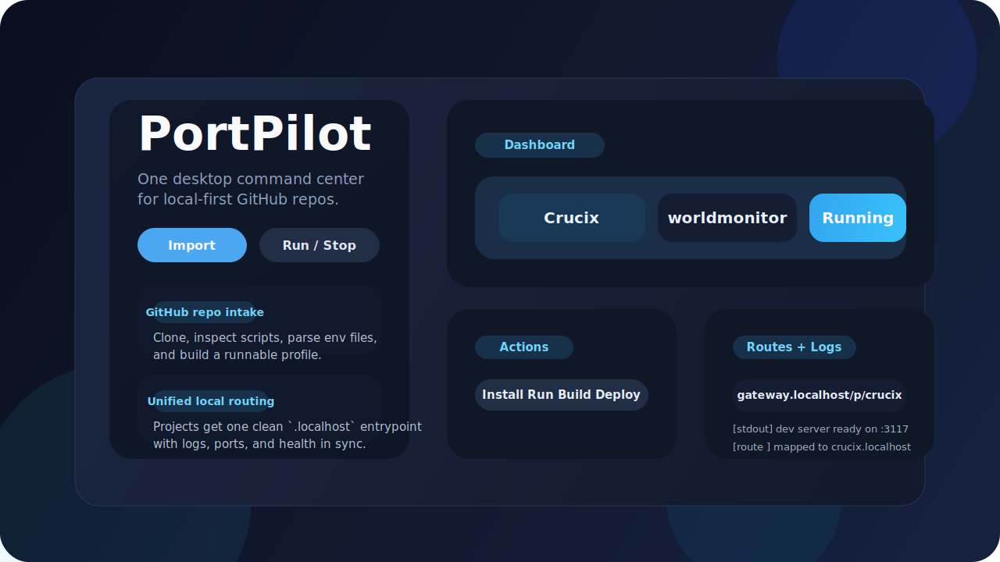
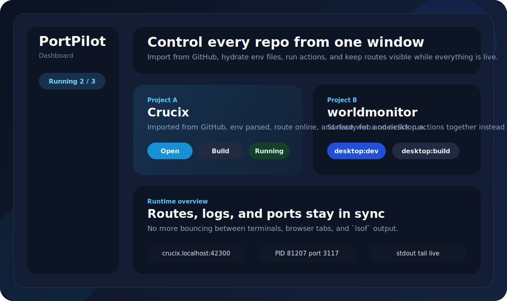
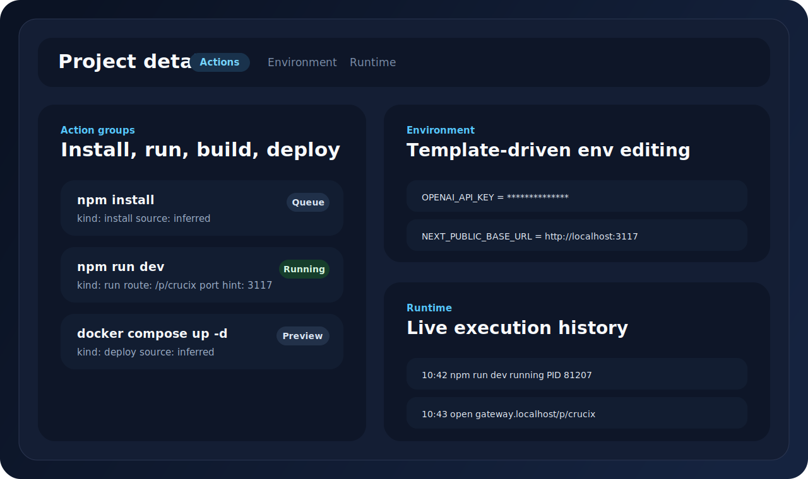
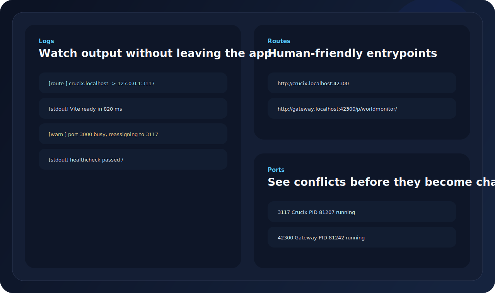

[简体中文](./README.zh-CN.md) | **English**

<div align="center">
  <h1>PortPilot</h1>
  <p><strong>Run, stop, route, and observe local-first GitHub repos from one desktop app.</strong></p>
  <p>PortPilot turns scattered terminal commands, random localhost ports, env templates, and build scripts into one coherent control center.</p>

  <p>
    
    
    
    
    
    
  </p>
</div>



## Why PortPilot

Most local web projects still expect you to stitch the workflow together by hand:

- clone a repo
- read the README
- guess the right install command
- hunt for `.env.example`
- find an open port
- open another terminal for logs
- remember which command stops everything later

PortPilot is the opposite approach. It gives GitHub repos a desktop control plane with:

- GitHub import and local project registration
- inferred install, run, build, deploy, and package actions
- env template parsing and `.env` generation
- unified `.localhost` routes
- live logs, execution history, and port visibility
- a release-ready desktop shell for macOS, Windows, and Linux

## Showcase

PortPilot is designed for repos like these:

| Repository | What PortPilot surfaces |
| --- | --- |
| [`calesthio/Crucix`](https://github.com/calesthio/Crucix) | `npm install`, `npm run dev`, env generation, compose actions, unified route opening |
| [`koala73/worldmonitor`](https://github.com/koala73/worldmonitor) | web run targets, `desktop:dev`, `build:*`, `desktop:build:*`, local runtime visibility |

## Product Preview

### One dashboard, multiple repos



### Action-centric project pages



### Routes, logs, and ports in one place



## Feature Map

| Area | What you get |
| --- | --- |
| Import | Clone from GitHub URL or register an existing local project |
| Detection | Infer actions for Node, Python, Rust, Go, and Docker Compose |
| Environment | Parse `.env.example` and save editable env profiles |
| Runtime | Start, stop, restart, build, deploy, and watch execution history |
| Routing | Map projects onto clean `.localhost` URLs through a local gateway |
| Observability | View logs, ports, status, and route bindings inside one UI |
| Updates | Release through GitHub Releases and prepare in-app updater flow |

## Quick Start

```bash
npm install
npm run tauri:dev
```

Then:

1. Add or confirm your workspace root.
2. Paste a GitHub URL like `https://github.com/calesthio/Crucix.git`.
3. Import the repo, review inferred actions, save env values, and hit `Run`.

## Downloads

The first public release is published as a GitHub pre-release.

- Go to [Releases](https://github.com/Horace-Maxwell/portpilot/releases)
- Download the package for your platform
- On the first macOS beta launch, you may need to manually allow the app in System Settings because the beta build is not notarized yet

### Planned release assets

- macOS: `.dmg`, `.zip`, updater `.tar.gz`
- Windows x64: `.msi`, optional portable `.zip`
- Linux x64: `.AppImage`, `.deb`, `.rpm`

## Beta Notes

- `v0.1.0-beta.1` is intended as the first public validation build
- macOS beta packages may show Gatekeeper warnings before the notarized channel is ready
- Windows and Linux packages are beta-quality validation builds
- stable in-app auto-update is reserved for the signed/notarized stable channel

## Roadmap

- Better repo inference for more monorepo layouts
- Stronger Docker and Compose orchestration
- Signed + notarized stable macOS release flow
- Polished release updater experience for all supported platforms

## Development

```bash
npm run typecheck
npm test
npm run build
npm run tauri build -- --debug
```

## Contributing

Issues and PRs are welcome, especially around repo detection, action inference, runtime orchestration, and cross-platform packaging.

## License

MIT. See [LICENSE](./LICENSE).
